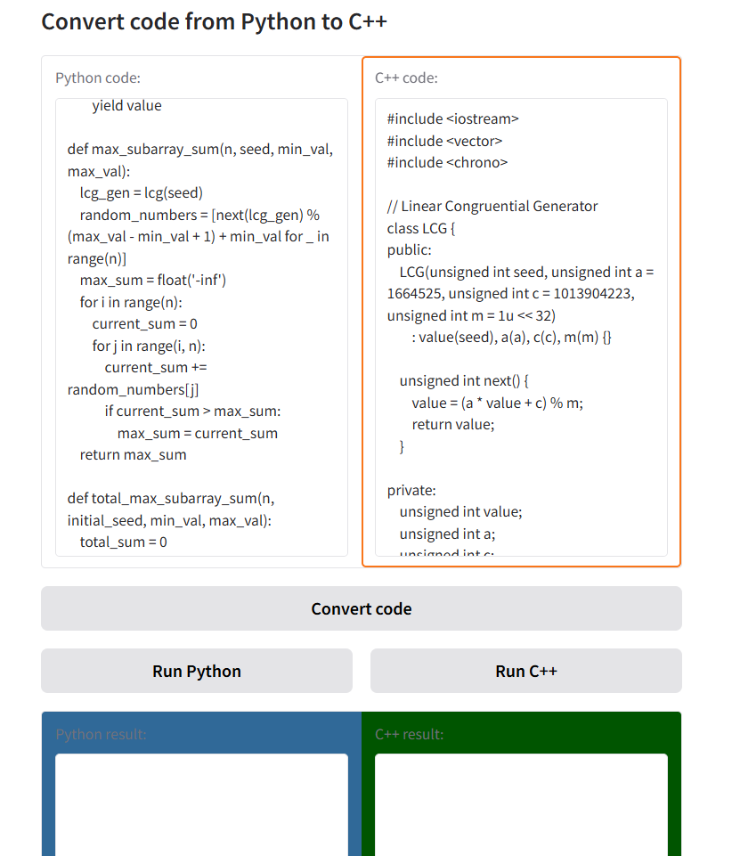

# Code Generator

## Overview

The **Code Generator** repository provides an automated solution for converting Python code into C++. It aims to simplify the process of translating Python scripts to C++ for users looking to optimize their code for performance or cross-language development.

This repository also includes practical demonstrations using Jupyter Notebooks and interactive Gradio interfaces to facilitate easy testing and usage.

---

## Table of Contents

- [Introduction](#introduction)
- [Image](#images)
- [Usage](#usage)
- [Code Generation](#code-generation)
- [Contributors](#contributors)
- [License](#license)

---

## Introduction

This repository includes tools for converting Python code into C++ in an efficient and automated way. Users can experiment with the process through a Jupyter Notebook, and view the results of code conversion, facilitated by an intuitive Gradio interface.

---

## Images

The following image illustrate key parts of the code conversion process.

###  **Gradio Interface for Python to C++ Conversion**




---
This image demonstrates the Gradio interface used in the tool for interactive code conversion. It provides a user-friendly way to input Python code and instantly see the corresponding C++ code.

## Usage

### Step 1: Clone the Repository

Clone the repository to your local machine:

```bash
git clone https://github.com/yourusername/repository-name.git
```

### Step 2: Navigate to the Code Generator Directory

Move into the `Code Generator` folder:

```bash
cd Code-Generator
```

### Step 3: Install Dependencies

Install the necessary Python dependencies using `pip`:

```bash
pip install -r requirements.txt
```

### Step 4: Run the Jupyter Notebook

Launch the Jupyter notebook to start experimenting with code conversion:

```bash
jupyter notebook code_generator.ipynb
```

This will open an interactive notebook where you can input Python code and view the generated C++ code.

---

## Code Generation

In the **Code Generator** directory, you'll find the `code_generator.ipynb` Jupyter Notebook. This notebook guides you through the conversion process from Python to C++, explaining each step involved.

The main sections of the notebook include:
- **Python Code Parsing**: How Python code is parsed and analyzed.
- **C++ Code Generation**: How the equivalent C++ code is generated based on the Python input.
- **Gradio Interface**: Interactive interface to convert Python code to C++ in real time.

Explore the notebook and test different Python code snippets to see how they are converted to C++.

---

## Contributors

This project is developed and maintained by:

- **Cherki Meziane** – Creator and lead developer
---

## License

This project is licensed under the MIT License. See the [LICENSE](LICENSE) file for more details.

---
